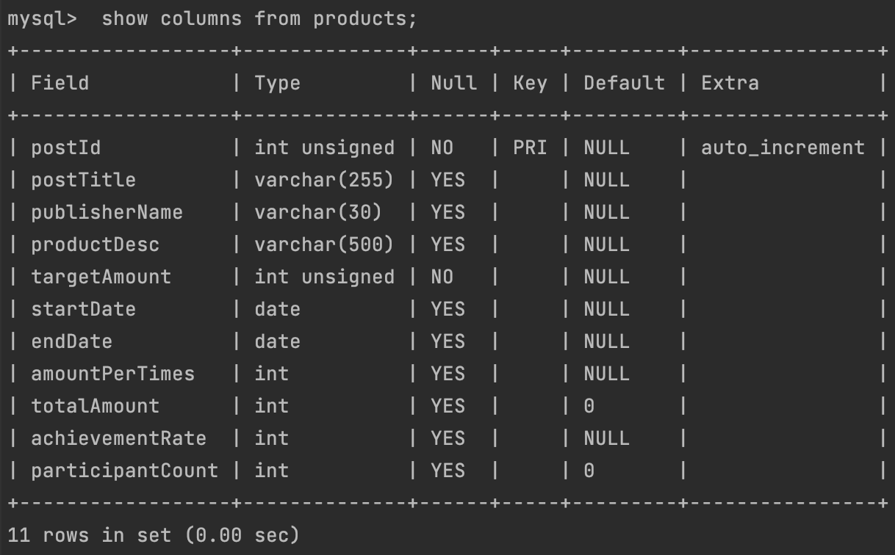

# Wanted Pre Onboarding - Backend

## contexts
* [Abstracts](#abstracts)
* [Requirements](#requirements)

### Abstracts
* 크라우드 펀딩
    * Publisher : 펀딩 유치를 위한 상품(=게시물) 등록
    * User : '1회 펀딩 금액' 펀딩

### Requirements
* RDBMS
    * Django ORM or SQLAlchemy
    * REST API 로 구현(Json response).

* To Do
    * sketch DATABASE and TABLE
    ```mysql
    # mysql
    CREATE DATABASE crowdfunding default CHARACTER SET UTF8;
    CREATE TABLE crowdfunding.products
    (
      postId INT UNSIGNED NOT NULL AUTO_INCREMENT COMMENT '게시글ID',
      postTitle VARCHAR(255) COMMENT '게시글제목',
      publisherName VARCHAR(30) COMMENT '게시자명',
      productDesc VARCHAR(500) COMMENT '상품설명',
      targetAmount INT UNSIGNED NOT NULL COMMENT '목표금액',
      startDate DATE COMMENT '펀딩시작일',
      endDate DATE COMMENT '펀딩종료일',
      amountPerTimes INT COMMENT '1회펀딩금액',
      totalAmount INT DEFAULT 0 COMMENT '총펀딩금액',
      achievementRate INT COMMENT '달성률',
      participantCount INT DEFAULT 0  COMMENT '참여자수',
      PRIMARY KEY(postId)
    );
    ```
    
    *  create ORM
