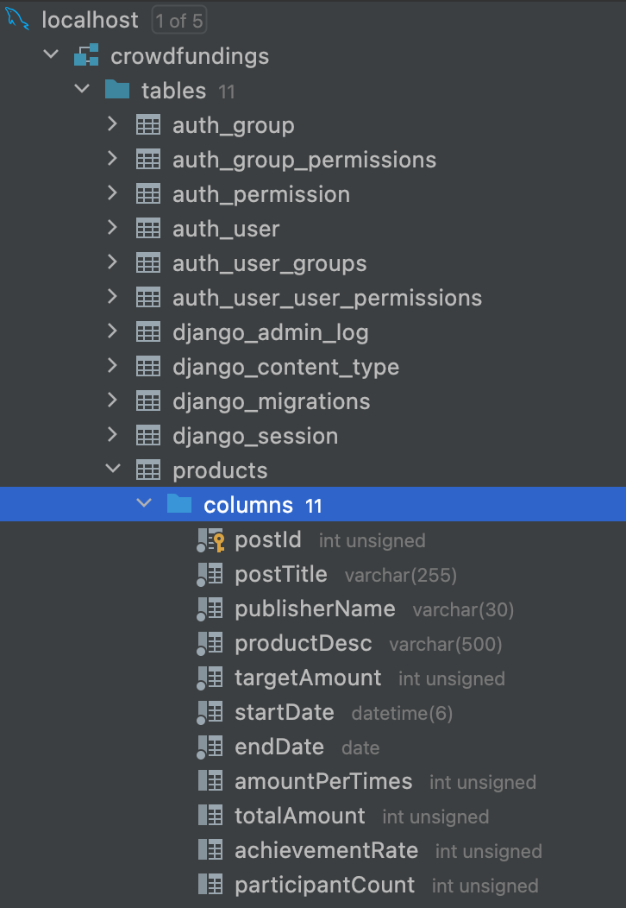

# Wanted Pre Onboarding - Backend

## contexts
* [Abstracts](#abstracts)
* [Requirements](#requirements)
* [Conclusions](#conclusions)

### Abstracts
* 크라우드 펀딩
    * Publisher : 펀딩 유치를 위한 상품(=게시물) 등록
    * User : '1회 펀딩 금액' 펀딩

### Requirements
* RDBMS
    * Django ORM or SQLAlchemy
    * REST API 로 구현(Json response).

* To Do
    * [x] sketch DATABASE and TABLE(models.py)
    ```mysql
    # mysql
    CREATE DATABASE crowdfunding default CHARACTER SET UTF8;
    CREATE TABLE crowdfunding.products
    (
      postId INT UNSIGNED NOT NULL AUTO_INCREMENT COMMENT '게시글ID',
      postTitle VARCHAR(255) COMMENT '게시글제목',
      publisherName VARCHAR(30) COMMENT '게시자명',
      productDesc VARCHAR(500) COMMENT '상품설명',
      targetAmount INT UNSIGNED NOT NULL COMMENT '목표금액',
      startDate DATE COMMENT '펀딩시작일',
      endDate DATE COMMENT '펀딩종료일',
      amountPerTimes INT COMMENT '1회펀딩금액',
      totalAmount INT DEFAULT 0 COMMENT '총펀딩금액',
      achievementRate INT COMMENT '달성률',
      participantCount INT DEFAULT 0  COMMENT '참여자수',
      PRIMARY KEY(postId)
    );
    ```
    | tables | fields |
    |--------|--------|
    |  |  |
    * create ORM(views.py)
      * [x] addProducts
      * [x] editProducts
      * [x] deleteProducts
      * [x] showProducts
      * [x] showProductDetails
    * [x] REST API(serializers.py)

### Conclusions
짧은 시간 동안 요구 사항을 충족하고자 확인한 사이트만 30여 개가 되는 것 같은데, 시간이 여유로웠다면 현재 못 미친 기준은 완성할 수 있지 않았을까하는 생각이 듬.
간만에 '잠은 죽어서 잔다.' 실천 중이라 재밌기도 한데, 이번 과제를 다른 과제와 병행하면서 진행하며 다양한 관점을 고려할 수 있었음.
물론 여전히 기술적 역량의 부족함을 느끼며 성찰 중이긴 한데,,, 그래도 어설프지만 마무리했다는 것에 의의를 둠.
